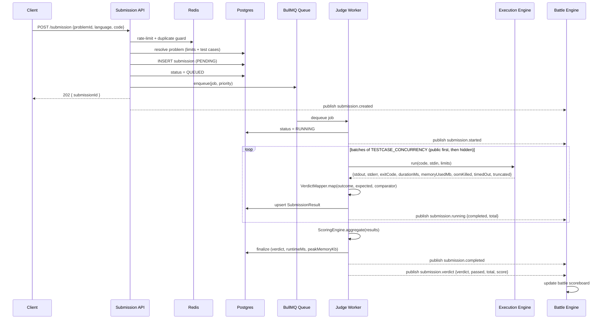
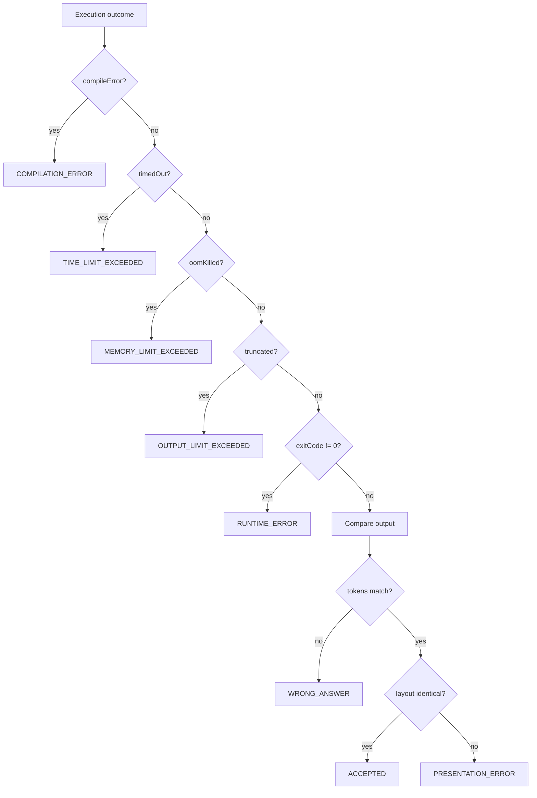
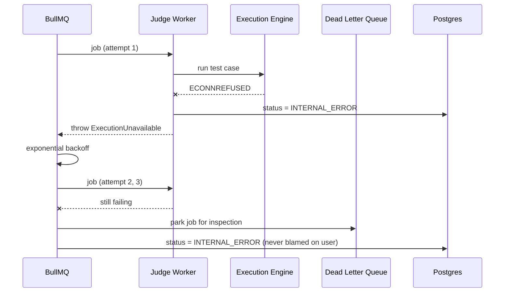

# DevArena Online Judge Service

Consumes execution results, runs public + hidden test cases, produces verdicts,
scores submissions, persists results, and publishes battle events. Built to
absorb 500k submissions/day.

## Zero schema changes

The existing schema already had everything:

- `SubmissionStatus` enum contains **all 13 verdicts** the spec lists (including
  `PRESENTATION_ERROR`, `OUTPUT_LIMIT_EXCEEDED`, `SKIPPED`, `INTERNAL_ERROR`).
- `SubmissionResult` stores the per-test-case verdict + runtime + memory + stderr,
  with `@@unique([submissionId, testCaseId])` making retried judging idempotent.
- `TestCase` has `isHidden`, `weight`, `order` — enough for public/hidden ordering
  and weighted partial scoring.
- `Problem` has `timeLimitMs` / `memoryLimitMb`.
- `Submission` has the `[status, createdAt]` index for queue recovery.

The one thing absent is a `comparator` column, so the judge **derives** it per
problem (float tolerance when expected outputs contain decimals, otherwise
whitespace-normalized token compare). Adding a column later changes exactly one
method: `PrismaProblemRepository.deriveComparator`.

## Submission → verdict (happy path)

## Verdict precedence (the critical ordering)

Resource limits are decided **before** output comparison: a program that timed
out or crashed has no meaningful stdout, so reporting it as `WRONG_ANSWER` would
be a lie. This precedence is the judge's contract with users.

## Failure path (retry → DLQ)

## Scaling to 500k/day

- **Async API** — `POST /submission` returns 202 after a durable insert + enqueue;
  no web request ever waits on a sandbox.
- **Horizontal workers** — throughput scales linearly with workers × concurrency
  since all coordination lives in Redis/BullMQ.
- **Bounded per-submission parallelism** — one 100-test-case submission can't
  monopolise the engine (`TESTCASE_CONCURRENCY`).
- **Stop-on-first-fail** — contest/battle submissions skip remaining cases after
  the first failure, cutting engine work dramatically on wrong submissions.
- **Priority queue** — battle submissions judged ahead of practice.
- **Idempotency** — `jobId = submissionId` means a submission is never
  double-queued; result upserts make retries safe.

## Files

- `comparators/output-comparator.ts` — token / exact / float compare + presentation detection.
- `verdict/verdict-mapper.ts` — execution outcome → verdict, with the precedence above.
- `scoring/scoring-engine.ts` — all-or-nothing and weighted-partial aggregation.
- `services/judge.service.ts` — the worker-side judging pipeline.
- `services/submission.service.ts` — API-side admission (rate limit, dedupe, enqueue).
- `queue/judge.queue.ts`, `queue/judge.worker.ts` — BullMQ queue + worker with DLQ.
- `repositories/` — Prisma submission/problem repos, HTTP execution adapter, Redis support.
- `events/redis-event-publisher.adapter.ts` — pub/sub + in-process battle bridge.
- `controllers/`, `routes/`, `validators/`, `docs/` — the REST surface.
